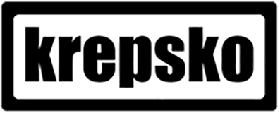
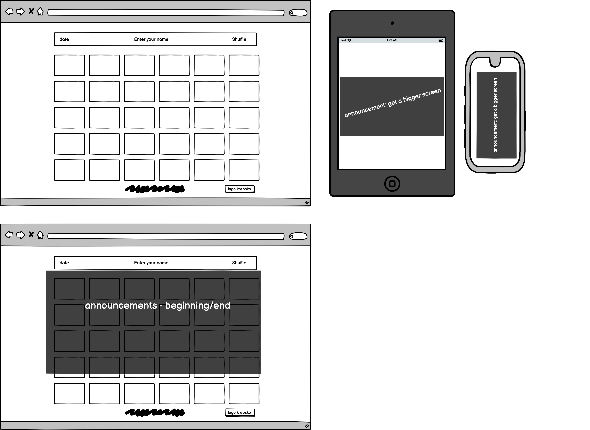
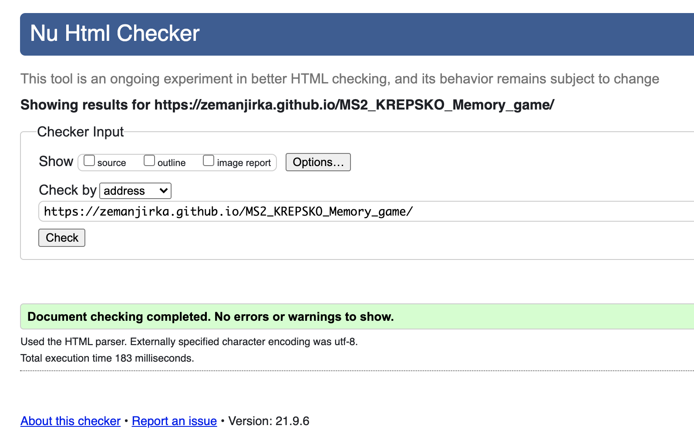
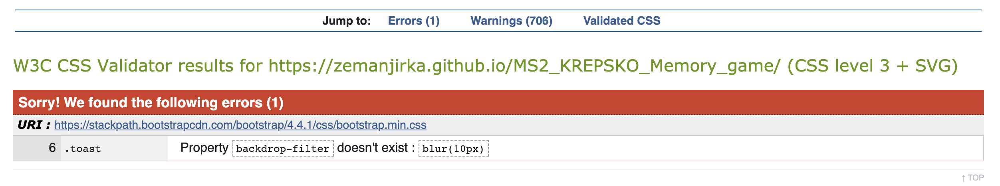

# MS2 - Memory game celebrating 20 years of existence of international theatre group

[View the live project here](https://zemanjirka.github.io/MS2_KREPSKO_Memory_game/)

 
## UX
KREPSKO is an international theatre group, founded in 2001. So this year KREPSKO celebrates 20 years of existance. I, Jiri Zeman, am one of the founders and directors who worked with KREPSKO all these years. I was fortunate enough to spend 20 years with this theatre traveling the world. During KREPSKO's travels many audiences and performers conected and still are somehow in contact - all those people (Krepsko's fans and Krepsko's staff) celebrate this year Krepsko's 20th birthday and will definetely enjoy a small memory game based on Krepsko's history and performances.

### From this web-page the user wants:
- mainly to have fun playing a memory game based on Krepsko's history a shows,
- to be reminded that his favourite theatre group celebrates 20 years of fruitfull existence

### User stories:
- the user should open the page and see a "welcome screen" informing briefly about Krepsko theatre group and its anniversary and describing the game goal - to match all 15 pairs
- because it is a memory game, it is important to be diplayed/playd on wider screens - so if user open the page on smaller (narrower) screen, user should see a message to open the page on wider (computer) screen
- the user should see the actual date 
- the user should see a sign inviting him to enter his name - if he does so, he will be "personally greeted" before the game
- the user should see a button (Let's do some KREPSKO stuff) that starts the game when clicked
- the user should be playing the memory game - till he pairs all 15 pairs
- after matching all 15 pairs the user should be let know, how many clicks he used to finih the gam
- according of number of clicks 
- the user should be awarded after the game with different closing message:
 > <strong>30 - 50 clicks: </strong>'You are either cheating or genius or a KREPSKO member!'

 > <strong>51 - 75 clicks: </strong>'You are kind of good at this! But you could be better'

 > <strong>76 - 100 clicks: </strong>'Not bad! But not good either. You should see some KREPSKO show! And then come back to play again!'

 > <strong>101 - 120 clicks:</strong> 'Really?! You should definetely see some KREPSKO show and then come back to play again!'

 > <strong>over 120 clicks: </strong>Are you a tee-too-tuum or what? Try again and better!'

- the user should see a button uder the closing message, that closes the message
- during all game the user should see a Shuffle button, that can shuffle/restart the game at any point of the game

Wireframes created at the very beginning of the process (slightly vary from the final result)

## Features

### Existing Features

- ***Memory Game*** - allows users to click the cards and play with the game

- ***New Game/ Shuffle*** - allows users to start a new game at any point of the game

- ***Player's name*** - allows users to enter his name and receive a personalised greeting

- ***Date*** - player should see actual date on the page

- ***Logo of KREPSKO theatre group*** - with a link to actual home page of the theatre group

### Features Left to Implement

- ***Highscore table***

## Technologies Used

The whole page was built with HTML, CSS and JavaScript 

### Other sources:
- [Bootstrap] (v5.0x) (https://getbootstrap.com/) For some particular details
- [GoogleFonts] (https://fonts.google.com/) to use Kelly slab font (this font KREPSKO theatre group uses on its pages)
- [Git] - Git is used to allow for tracking of any changes in the code and for the version control
- [GitPod] - GitPod, connected to GitHub, hosted the coding space and allowed the project to be committed to the Github repository.
- [Github] - GitHub is used to host the project files and publish the live website by using Git Pages
- [Balsamiq] (https://balsamiq.com/) for creating the wireframes

## Testing 

https://validator.w3.org/nu/ 

http://www.css-validator.org/ 

Lighthouse - dev. tools Google Chrome: 
