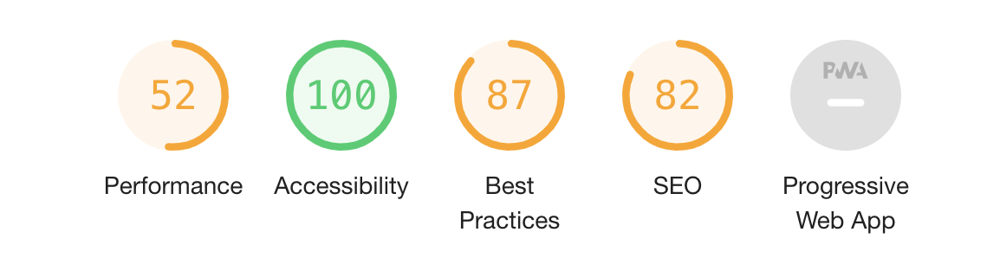

# MS2 - Memory game celebrating 20 years of existence of international theatre group KREPSKO

[View the live project here](https://zemanjirka.github.io/MS2_KREPSKO_Memory_game/)

 
## UX
KREPSKO is an international theatre group, founded in 2001. So this year KREPSKO celebrates 20 years of existance. I, Jiri Zeman, am one of the founders and directors who worked with KREPSKO all these years. I was fortunate enough to spend 20 years with this theatre traveling the world. During KREPSKO's travels many audiences and performers conected and still are somehow in contact - all those people (Krepsko's fans and Krepsko's staff) celebrate this year Krepsko's 20th birthday and will definetely enjoy a small memory game based on Krepsko's history and performances.

### From this web-page the user wants:
- mainly to have fun playing a memory game based on Krepsko's history a shows,
- to be reminded that his favourite theatre group celebrates 20 years of fruitfull existence

### User stories:
- the user should open the page and see a "welcome screen" informing briefly about Krepsko theatre group and its anniversary and describing the game goal - to match all 15 pairs
- because it is a memory game, it is important to be diplayed/playd on wider screens - so if user open the page on smaller (narrower) screen, user should see a message to open the page on wider (computer) screen
- the user should see the actual date 
- the user should see a sign inviting him to enter his name - if he does so, he will be "personally greeted" before the game
- the user should see a button (Let's do some KREPSKO stuff) that starts the game when clicked
- the user should be playing the memory game, till he pairs all 15 pairs
- after matching all 15 pairs the user should be let know, how many clicks he used to finish the game 
- according to the number of clicks the user should be awarded after the game with different closing message:
 > <strong>30 - 50 clicks: </strong>'You are either cheating or genius or a KREPSKO member!'

 > <strong>51 - 75 clicks: </strong>'You are kind of good at this! But you could be better'

 > <strong>76 - 100 clicks: </strong>'Not bad! But not good either. You should see some KREPSKO show! And then come back to play again!'

 > <strong>101 - 120 clicks:</strong> 'Really?! You should definetely see some KREPSKO show and then come back to play again!'

 > <strong>over 120 clicks: </strong>Are you a tee-too-tuum or what? Try again and better!'

- the user should see a button under the closing message, that closes the message
- during all game the user should see a Shuffle button, that can shuffle/restart the game at any point of the game

Wireframes created at the very beginning of the process (slightly vary from the final result)

## Features

### Existing Features

- **Memory Game** - allows users to click the cards and play with the game

- **New Game/ Shuffle** - allows users to start a new game at any point of the game

- **Player's name** - allows users to enter his name and receive a personalised greeting

- **Date** - player should see actual date on the page

- **Logo of KREPSKO theatre group** - with a link to actual home page of the theatre group

### Features Left to Implement

- **Highscore table**

## Technologies Used

The whole page was built with HTML, CSS and JavaScript 

### Other sources:
- [Bootstrap] (v5.0x) (https://getbootstrap.com/) For some particular details
- [GoogleFonts] (https://fonts.google.com/) to use Kelly slab font (this font KREPSKO theatre group uses on its pages)
- [Git] - Git is used to allow for tracking of any changes in the code and for the version control
- [GitPod] - GitPod, connected to GitHub, hosted the coding space and allowed the project to be committed to the Github repository.
- [Github] - GitHub is used to host the project files and publish the live website by using Git Pages
- [Balsamiq] (https://balsamiq.com/) for creating the wireframes

## Testing 

https://validator.w3.org/nu/ 

http://www.css-validator.org/ 

Lighthouse - dev. tools Google Chrome: 

### Manually tested all the features:

> **the date** - appears always actual and correct

> **the logo of Krepsko in the footer** - when clicked always opens new window with Krepsko homepage

> **the player's name** - always gives personalized greeting after entering the name of player

> **the Shuffle button**- always shuffels card and starst new game

> **the buttons at the end of opening and closing screen** - always close the message and return to the game

> **the game itselfs**:
>> if 2 cards with different motives are clicked after each other - for cca 1 sec remain turned with the front page up (to give a chance for the player to remember), then turn back to the back side
>
>> if 2 cards with the same motive are clicked after each other, they stay with the front side up and player can move to another cards
>
>> when all pairs are found (clicked cards with the same motive after each other), closing window appears - announcing the end of game, mentioning the numer of clicks player used and according to the number of clicks shows closing message > <strong>30 - 50 clicks: </strong>'You are either cheating or genius or a KREPSKO member!'
>
 >> <strong>51 - 75 clicks: </strong>'You are kind of good at this! But you could be better'
>
 >> <strong>76 - 100 clicks: </strong>'Not bad! But not good either. You should see some KREPSKO show! And then come back to play again!'
>
 >> <strong>101 - 120 clicks:</strong> 'Really?! You should definetely see some KREPSKO show and then come back to play again!'
>
 >> <strong>over 120 clicks: </strong>Are you a tee-too-tuum or what? Try again and better!'

 ## Compatibility Testing

### Browser Compatibility
- Tested on Chrome, Firefox, Opera, Internet Explorer, Microsoft Edge, Safari
- OS Compatibility
- Tested on iOS , Android 10 and Windows 10
- Tested for responsivness on Chrome DevTools

## Covering the Users stories:

- the user opens the page and sees a "welcome screen" informing briefly about Krepsko theatre group and its anniversary and describing the game goal - to match all 15 pairs
- so if the user opens the page on smaller (narrower) screen, user sees a message to open the page on wider (computer) screen
- the user sees the actual date 
- the user sees a sign inviting him to enter his name - if he does so, he sees personalized greeting
- the user sees a button (Let's do some KREPSKO stuff). This button starts the game when clicked
- the user plays the memory game, till he pairs all 15 pairs
- after matching all 15 pairs the user sees how many clicks he used to finish the game
- according of number of clicks the user is awarded after the game with different closing message
- the user sees a button under the closing message, that closes the message
- during all game the user sees a Shuffle button, that shuffles/restarts the game at any point of the game

### Bugs and problems:
- the CSS validator points out a problem that I do not understand and therefore do not know how to solve: http://www.css-validator.org/ 

- while testing in different browsers I found out that in **Safari browser** the turning moevemnt of the cards does not work properly - because the turning of the cards in memory game is crucial, unfortunatelly in Safari this game is not playable. I browsed and searched for help online but did not find any solution for this problem.

### Publishing

This website was published using GitHub Pages. The procedure is outlined below.

- Go to the GitHub website and log in.
- On the left-hand side, you'll see all your repositories, select the appropriate one: **zemanjirka/MS2_KREPSKO_Memory_game**.
- Under the name of your chosen Repository you will see a ribbon of selections, click on 'Settings' located on the right hand side.
- Scroll down till you see 'GitHub Pages' heading.
- Under the 'Source' click on the dropdown and select 'master branch'
- The page will reload and you'll see the link of your published page displayed under 'GitHub' pages.
- It takes a few minutes for the site to be published, wait until the background of your link changes to a green color before trying to open it.

### Forking

If you wish to contribute to this website you can Fork it without affecting the main branch by following the procedure outlined below.

- Go to the GitHub website and log in.
- Locate the Repository used for this project: **zemanjirka/MS2_KREPSKO_Memory_game**
- On the right-hand side of the Repository name, you'll see the 'Fork' button. It's located next to the 'Star' and 'Watch' buttons.
- This will create a copy in your personal repository.
- Once you're finished making changes you can locate the 'New Pull Request' button just above the file listing in the original repository.

### Cloning

If you wish to clone or download this repository to your local device you can follow the procedure outlined below.

- Go to the GitHub website and log in.
- Locate the Repository used for this project: **zemanjirka/MS2_KREPSKO_Memory_game**
- Under the Repository name locate 'Clone or Download' button in green.
- To clone the repository using HTTPS click the link under "Clone with HTTPS".
- Open your Terminal and go to a directory where you want the cloned directory to be copied in.
- Type Git Clone and paste the URL you copied from the GitHub.
- To create your local clone press Enter

## Credits

### Content

- all the texts were created by me

### Media

- all the photos belong to KREPSKO theatre group. Since I am one of the founders and one of the main members of KREPSKO theatre group I have full usage rights to use any of these photos in any way I want. 

### Acknowledgements

- before starting to work on this project I saw and studied several MS2 projects of other Code Institute students presented on the Slack platform 

